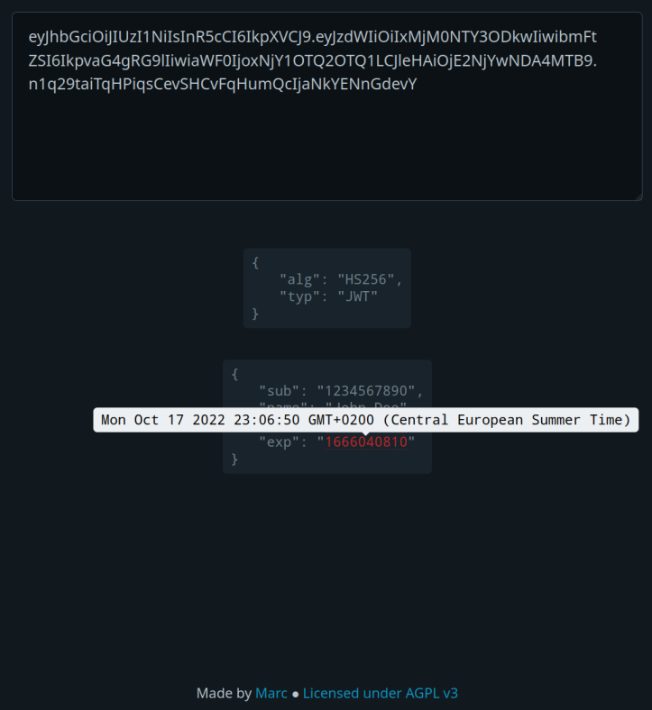

# JWT Decoder

A simple, zero dependency, client-side web app for decoding JSON Web Tokens (JWT).

Hover over the `exp` or `iat` date to see it in a human-readable format and in your browser's timezone. 
In addition, the `exp` date is highlighted in red to indicate that the JWT has expired.

**[---> DEMO <---](https://marc.codeberg.page/jwt-decoder)**

## Screenshot

## License

[AGPL v3](https://codeberg.org/marc/jwt-decoder/src/branch/main/LICENSE)
